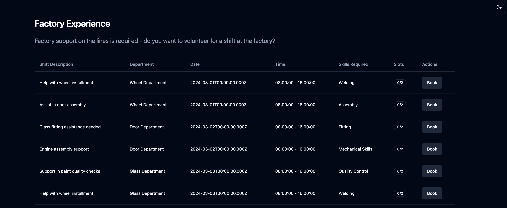

# Factory Experience Design

## Overview


## Running with compose

1. Run in the root folder:
```bash
docker-compose up
```

2. Seed some data into the DB (no time to implement proper seeding mechanism...):
```bash
cd e2e && psql -e --set ON_ERROR_STOP=on -h "localhost" -U "postgres" -d "postgres" -p "5432" -f seed.sql
```

3. Get access token:
```bash
curl -X POST http://localhost/api/v1/auth/login \
     -H 'Content-Type: application/json' \
     -d '{"email": "user0@example.com", "password": "1234"}'
```

and paste the token in `frontend/src/pages/volunteer-submission/volunteer-submission.service.ts` at line 2: `const BEARER_TOKEN=<>`

4. Access the frontend at `http://localhost:8080` - or play around with the [APIs](http://localhost/swagger)

> You can also run the backend and frontend separately, by following the instructions in their respective READMEs

## Backend Design

### Database


1. `Users` - Stores information about employees, including their name, email/password (Basic AuthN) and roles(AuthZ).
1. `Shifts` - Conceptualized as an arbitrary job that should be done during a particular given time-window at a particular department. A shift can have many support requests (e.g:  a single shift might need support in different roles such as assembly, quality, maintenance etc.). Normally departments would be a separate table/entity, but went with a smaller scope for this POC.
1. `SupportRequests` - A support request is a specific need for support during a shift. It has a many-to-one relationship with Shifts, and contains metadata around that support need (work description, number of slots available, skills required)
1. `VolunteerSubmissions` - An associative table that links employees to shifts they have signed up for. Employees can sign up for multiple shifts, and each shift can have multiple employees signed up as volunteers. Contains additional metadata around the submission (e.g: when the submission was done, whether the submission has been confirmed by the line manager)

### NestJS Modules

Two applications structures were considered for this project:
1. **Module per entity** - provides clearer separation of concern, but leading to more boilerplate code and tight coupling between closely-related modules
1. **Modules per domain** - (DDD/bounded-context approach) brings more simplicity in handling closely related data (less inter-module dependencies), but can lead to a bloated modules

> **Due to the small scope and size of the project, approach 1) was selected.**

> The following diagram shows the module dependencies:


1. `Users Module` - Handles user-related operations such as user registration and login
1. `Auth Module` - Handles authentication and authorization, using PassportJS for implementing strategies for user registration (local strategy) and login (JWT strategy). It also provides guards and decorators for route protection and whitelisting
1. `Shifts Module` - Handles operations related to work shifts, such as creating, listing, and updating shifts
1. `SupportRequests Module` - Handles the creation of support requests. Additionally, exposes API endpoint that frontend uses to list support requests in a denormalized view - this is done by interacting with Shifts and VolunteerSubmissions repositories directly for faster implementation, but using corresponding modules/services would be the right way.
1. `VolunteerSubmissions Module` - Handles volunteer submissions to support requests and exposes management endpoints (e.g: confirm attendance). Exposes `POST /volunteer-submissions` endpoint that frontend uses to book a slot in particular volunteer request

### API Endpoints

Exposed under `http://localhost/swagger`


### Main Technical Decisions

#### Overbooking

One potential problem with the system is overbooking - where the number of `volunteer_submissions` for a `support_request` can surpass the given limit(`number_needed`).  
The easiest way to avoid this situation is to check the number of slots available (COUNT `volunteer_submissions` already submitted for this `support_request`) before inserting a new `volunteer_submission`, but in some scenarios this would not be enough.    
We can imagine a replicated(horizontally scaled) backend application that handles +2 requests in true parallel, and both requests try to add a `volunteer_submission` for same `support_request` - being run at the same time, both handlers would get the same count result (i.e: `number_needed-1`), and both will be persisted - therefore leading to overbooking.

To address this issue, two approaches were considered:

**Pessimistic**
* We wrap the logic of (`get support_request limit ->  calculate current_count -> persist if OK`) in a transaction, and use a `pessimistic_write` lock on the initial `support_request` row read. This approach makes sure that concurrent transactions cannot read the same `support_request` concurrently, and therefore achieving (theoretical, no time for fully testing) serializability.

**Optimistic**
* We again use the counting logic, but we don't use transactions and/or locking. Overbookings can happen, but once a day in a CRON we can check for overbookings and delete latest volunteer_submission.

> In this demo a pessimistic approach was implemented.

> [Sample E2E Test](./e2e/e2e.sh) - this file implements a simple e2e test that demonstrates the handling of overbooking

#### API Protection and Authorization

Distinction between public/private routes was implemented with basic RBAC and Role Guards - the following hierarchy applies:

* By default, all routes are protected (JWTGuard), unless `@Public()` decorator is used explicitly (whitelisted)
* By default, all routes that are JWT protected can be accessed by all types of users, unless a combo of `@Roles(Role.ROLE)` decorator and `@UseGuards(RolesGuard)` are used to restrict access to specific roles
* Some routes will use request context (current user in JWT) to perform their tasks (e.g: `POST volunteer-submissions`) 

## Frontend Design

The frontend is a simple React application, scaffolded with Vite and using [ShadCN](https://ui.shadcn.com/) as component library.  
All UI components are found under `/components` folder, and the main application is under `/pages`.

Page folders contain the React components that are used to render the views (`.page.tsx`) and services that are used to fetch data from the backend (`.service.ts`).
At the moment the services have hardcoded URLs and access token due to lack of proper login/registration flow (and subsequent local storage of the token).



# Additional Questions

## Business Requirements

1. Provide an overview of stakeholders you think you need to hear from and report to along with risks and challenges you can expect from them

Hear from:
- **Production Line Managers**: Understand the specific needs for support on the production line and the type of work required
- **Office Workers**: Potential users/volunteers of the system, can provide insights into motivations or fears for signing up
- **HR Department**: For providing policies and guidelines for volunteer work
- **Infra/IT Department**: Responsible for technical infrastructure and security of the new system
- **Senior Management**: Provide resources for the project (and headcount)

Report to:
- **Project Sponsor**: A person with interest in the success of the new system implementation
- **Stakeholders**: Perhaps a group of representatives from each key stakeholder group to discuss progress and resolve issues

Risks:
- **Change Resistance**: Employees can resist from transitioning to a new system (old system may not be perfect, but it's familiar)
- **Lack of Added Value**: If the new system doesn't provide significant benefits, the project can be discontinued in favor of keeping old system
- **Scope Explosion**: As the project progresses, new features and requirements can be added, leading to bigger and bigger scope
- **Data Security**: Properly ensuring the privacy and security of employee information

2. If you were to deliver on iterations, what are the priorities for the business you expect?

Iteration 1: MVP (Current Demo)
- **Basic Functionality**: Enable line managers to request support and office workers to sign up for shifts.
- **User Authentication**: Implement basic security to protect employee information.

Iteration 2: Enhanced Features 
- **Expand DB Schema**: Add more entities to support more complex requirements (roles table, departments table, location table etc.)
- **Expand UI**: Allow login/registration flow (or SSO integration with existing auth providers)
- **UI for Line Managers**: Allow for line-managers to create/manage shifts and support requests
- **Fine-Grained Work Specifications**: Allow for detailed requirements specification for each shift
- **Volunteer Feedback**: Implement a mechanism for feedback from volunteers post-shift
- **Improve Implementation**: Pagination/filtering/searching/sorting, use TypeORM migrations and seeds, implement observability (logging, metrics, alerts), improve OAS specification etc. 
- **Prepare for Production**: Connect with infra to provision needs (Hashicorp Vault, DB, CDN, EKS, Prometheus, Grafana, ELK etc.), implement K8s/Helm charts for deployment, implement CI/CD pipeline, feature flags, increase test coverage etc.

Iteration 3: Optimization and Scaling
- **Reporting Tools**: For HR and senior management to track participation and impact
- **Integration**: With other HR and operational systems for seamless experience

3. What is the impact on the business, i.e. Business Metrics?

Impact:
- **Employee Engagement**: Increased participation in volunteering could lead to higher employee satisfaction and retention
- **Operational Efficiency**: Reduced downtime/increased productivity on the production line

Metrics:
- **Volunteer Sign-Up Rate**: Percentage of posted shifts that are filled
- **Employee Participation**: Number of unique volunteers per period
- **Shift Coverage Efficiency**: How quickly support needs are met after being posted

4.  Please outline any assumptions you may have considered

- **Volunteer Willingness**: Office workers are willing to volunteer if the process is simplified
- **Technical Infrastructure**: The existing infrastructure team can support the development and hosting this app
- **Management Support**: Senior management is committed to improving the current process and will provide necessary resources

## System Design

1. Non-Functional Requirements

- **Scalability**: The system must be able to scale (auto-scale) to accommodate all employees and shifts without performance degradation
- **Availability**: The system should have high availability, especially during peak usage times (SLA of 99.9% should be enough)
- **Response Time and Correctness**: The system should provide quick feedback to user actions, with API responses and page loads taking no longer than 2 seconds while achieving correctness (no overbookings)
- **Disaster Recovery**: The interface should be user-friendly to encourage adoption
- **Usability**: Regular, automated backups of the database and essential system configurations must be implemented for minimal data loss
- **Security**: Ensure data privacy and protection against unauthorized access

2. How would you measure the success of the system in general?

- **Satisfaction Surveys**: Regular feedback from both line managers and volunteers to publish satisfaction and identify improvement areas
- **Adoption Rates**: Monitoring signup rates as a relation to system acceptance
- **Operational Metrics**: Tracking the efficiency of filling support needs and the impact on production line efficiency
